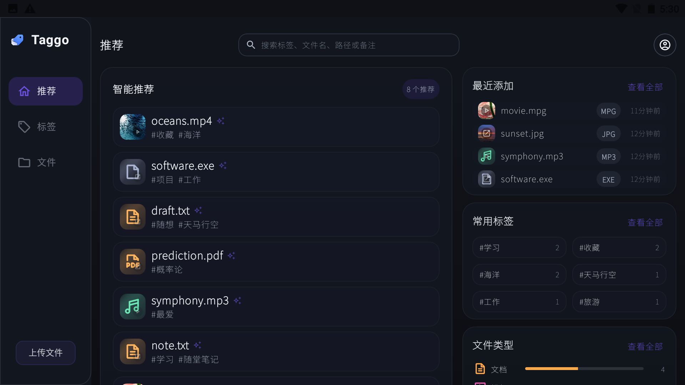
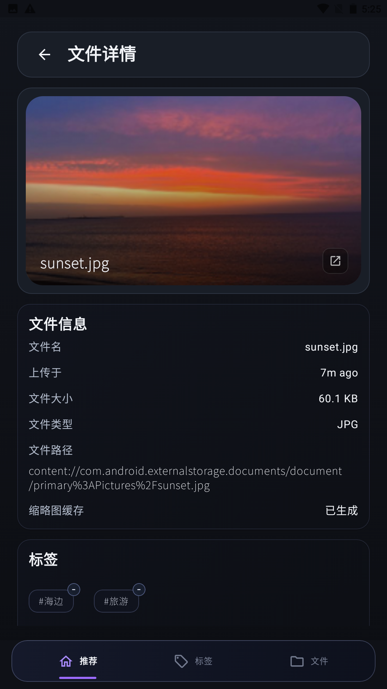
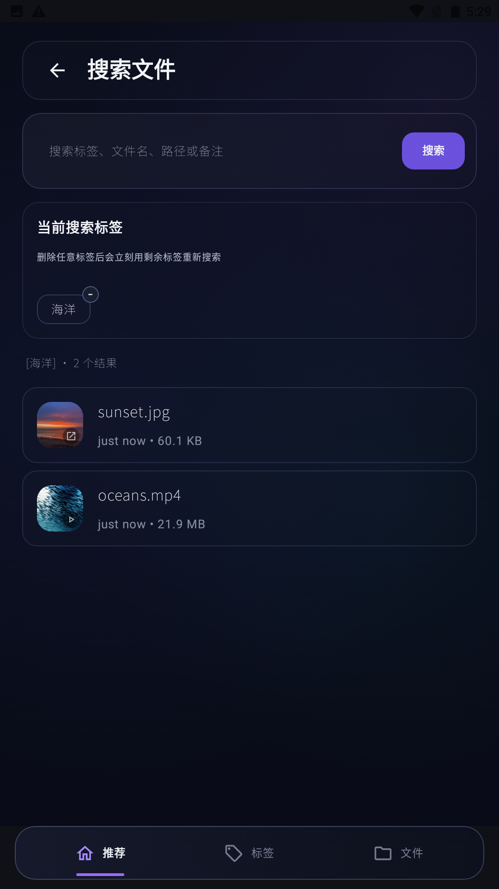
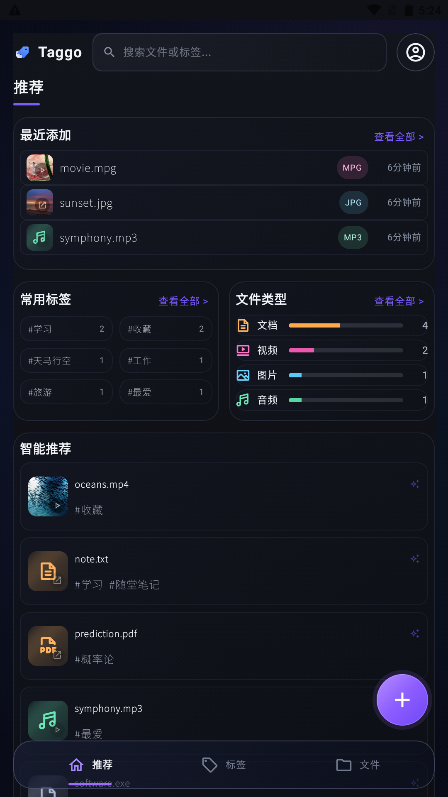

# Taggo

[English](README.en.md) | 简体中文

Taggo 是一个本地优先的跨平台文件管理工具。它通过标签、封面图、搜索和使用记录，帮助用户重新找到分散在本地的文件。



## 项目简介

传统文件夹很难表达一个文件同时属于学习、工作、设计或参考资料等多个场景。Taggo 不移动原文件，而是在本地文件之上维护标签和使用信息。

这是一个个人学习和求职展示项目，目前仍在开发中，尚不是完整发布版。

## 当前功能

- 添加和管理本地文件引用
- 查看文件封面图和基础信息
- 添加、移除和检索标签
- 按关键词与标签搜索文件
- 查看最近添加和最近打开的文件
- 根据本地使用记录生成简单推荐
- 适配 Android 和 Web 等平台的文件处理与界面

## 项目截图

| 首页 | 文件详情 |
|---|---|
|  |  |

| 搜索 | Android |
|---|---|
|  |  |

## 技术栈

- Kotlin Multiplatform
- Compose Multiplatform
- SQLDelight
- Kotlin Coroutines
- Kotlin Serialization

## 当前开发重点

- Android 文件选择、打开和权限适配
- 使用 SQLDelight 重建本地数据层
- 图片与视频缩略图
- 关键词和标签搜索
- 基于打开间隔与文件后继关系的本地推荐逻辑

## 工程实践

- 在 `commonMain` 中组织共享模型、Repository 和业务规则
- 隔离 Android、JVM、Web 等平台能力
- 使用 SQLDelight Repository 和内存 SQLite 测试验证数据读写
- 通过单元测试覆盖搜索与推荐核心逻辑
- 逐步从旧 JSON 快照迁移到结构化本地数据库

## 运行项目

构建 Android 调试版本：

```powershell
.\gradlew.bat :composeApp:assembleDebug
```

运行桌面版本：

```powershell
.\gradlew.bat :composeApp:run
```

运行 Web 开发版本：

```powershell
.\gradlew.bat :composeApp:wasmJsBrowserDevelopmentRun
```